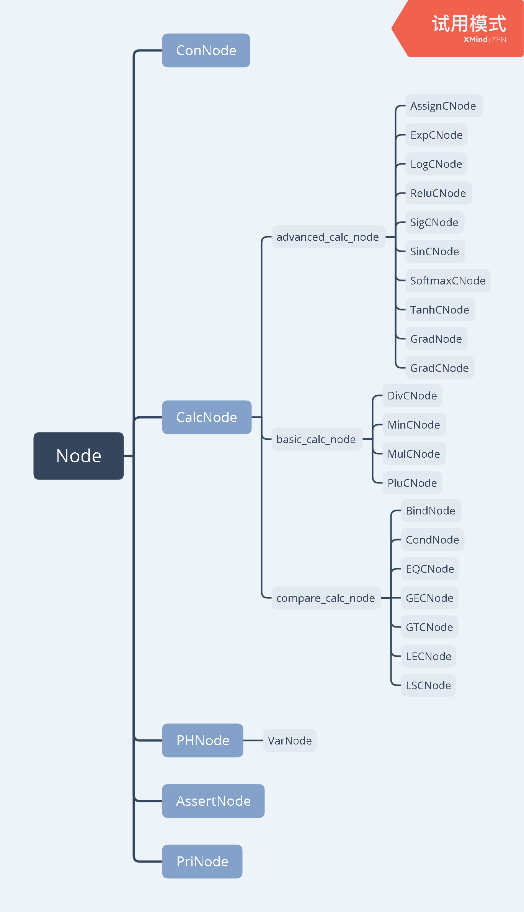

# 开发注记

## 设计思路

### `class Node` 及其派生类

对于计算图的每一种节点，都有一个纯虚基类 `Node<_T>` 的派生类对应

类的继承关系如图，所有的继承都为 `public` 继承



每个节点都是一个对象，都有一个 `_T` 型指针 `_T *Result` 来记录在本次计算中的临时结果，并在计算结束后按需清除

每个节点都有虚函数 `_T GetVal()` 用于获取计算结果和保证不重复计算，都有虚函数 `void Clear()` 用来清除临时结果并递归清理其依赖节点的临时结果

### `CalcNode` 的处理

纯虚类 `CalcNode` 拥有最多的直接派生类，设计上集中了所有计算节点的公用功能——构造、求值、清除等

将计算函数作为纯虚函数留待派生类进行自定义，具体扩展方法可以参见后文

### `ComGraph`

`ComGraph` 是计算图的主体，也是主程序唯一应当建立的对象类型，所有的操作都应当通过 `ComGraph` 的接口完成

`ComGraph` 使用 `map<string, Node<_T>*>` 进行名字到节点地址的索引，由于索引中的节点可能被后建立的同名节点覆盖，因此额外建立一个 `vector<Node<_T>*>` 来记录已经建立的所有节点的地址方便遍历和清除。为实现session，额外建立一个`map<string, Node<_T>*` 用来存储变量节点的名字及对应的节点地址。


本类提供的接口主要有：

- 各种节点的建立（其中所有 `CalcNode` 的建立共用一个带模板的函数使功能更加聚合）
- 查找某个名称的节点是否已存在，通过名字查找节点
- 设置/清除变量的值
- 给定一些占位符的值并计算某个节点的值

本类还提供了一个 `vector<_T>` 来记录每次操作的历史答案，并提供了一对配套的接口——存储与读取

对于一些常见错误，也提供了一定的预警和纠错机制

## 库与类功能介绍

### Node

`Node` 是一个虚基类

#### 保护成员列表：

##### `_T *Result;`

用于储存计算结果，为空表示未计算出答案

##### `string name`
用于存储节点自身的名字

#### 公开成员列表：

##### `virtual _T GetVal() = 0;`

纯虚函数，获取答案时使用，需要在派生类中被重载

##### `virtual void Clear() = 0;`

纯虚函数，清除答案，需要在派生类中被重载

##### `virtual _T grad(Node<_T>* node);`

虚函数，用于对node节点进行求导计算

<br/>

### ConNode : Node

`ConNode` 继承自 `Node` ，是常数节点

#### 私有成员列表

##### `_T *const ConVal;`

用来储存常数值

初始化时就必须将 `ConVal` 指针指向 `_T` 类常数

#### 公开成员列表

##### `_T GetVal();`

重载基类的 `GetVal()` ，直接返回 `*ConVal`

##### `void Clear();`

重载基类的 `Clear()` ，什么都不干

##### `virtual _T grad(Node<_T>* node);`

重载基类的 `grad(Node<_T>*)`，对node进行求导

<br/>

### PHNode : Node

`PHNode` 继承自 `Node` ，是占位符节点

#### 私有成员列表

##### `const std::string ErrMsg;`

一个字符串，会在需要 `GetVal()` 但本节点并未被赋值时被作为异常抛出

#### 公开成员列表

##### `_T GetVal();`

重载基类的 `GetVal()` ，返回被 `SetVal(_T)` 赋的值

若未被 `SetVal(_T)` 赋值过，则抛出 `ErrMsg`

##### `_T SetVal(_T);`

在Eval的时候会被调用，给该节点赋值，结果储存在 `*Result`

##### `virtual _T grad(Node<_T>* node);`

重载基类的 `grad(Node<_T>*)`，对node进行求导

<br/>

### VarNode : PHNode

`VarNode` 继承自 `PHNode` ，是变量节点

#### 私有成员列表

##### `const std::string ErrMsg;`

一个字符串，会在需要 `GetVal()` 但本节点并未被赋值时被作为异常抛出

#### 公开成员列表

##### `_T GetVal();`

重载基类的 `GetVal()` ，返回被 `SetVal(_T)` 赋的值

若未被 `SetVal(_T)` 赋值过，则抛出 `ErrMsg`

##### `_T SetVal(_T);`

在Eval的时候会被调用，给该节点赋值，结果储存在 `*Result`

##### `virtual _T grad(Node<_T>* node);`

重载基类的 `grad(Node<_T>*)`，对node进行求导

<br/>

### CalcNode : Node

`CalcNode` 继承自 `Node` ，是进行计算操作的节点，是虚基类

#### 保护成员列表

##### `const int OperandNum;`

记录计算节点操作元的个数

##### `Node<_T> **Operands;`

指向所有操作元的指针数组

##### `virtual _T Calc() = 0;`

虚函数，进行计算，结果储存在 `Result` 中

不可从外部调用，仅在 `Result` 为空指针时由 `GetVal()` 调用

#### 公开成员列表

##### `_T GetVal();`

重载基类的求值函数，在 `Result` 为空指针时调用 `Calc()` 求值，否则直接返回答案

##### `void Clear();`

重载基类的清除函数，会在清除自身答案前递归调用所有操作元的清除函数


##### `virtual _T grad(Node<_T>* node);`

重载基类的 `grad(Node<_T>*)`，对node进行求导


#### 构造函数

##### `CalcNode(int, const vector<Node<_T> *> &, string)`

推荐的构造方法，给出操作元个数，给出操作元指针列表以及自身名字来初始化一个CalcNode（的派生类），可以有效避免vector后面一不小心加入了多余的东西

##### `CalcNode(const vector<Node<_T> *> &, string)`

给出操作元指针列表以及名字来初始化一个CalcNode（的派生类），请确保指针列表仅仅只含有操作元的指针

<br/>

### PriNode : Node

`PriNode` 继承自 `Node` ，是输出节点

#### 保护成员列表

##### `std::string WatchName`

需要被输出的节点名称

##### `Node<_T> *WatchNode`

需要被输出的节点地址

##### `_T Print()`

在首次对该节点求值时调用，求出被观察节点的答案，输出，并将之作为本节点的答案

#### 公开成员列表

##### `_T GetVal()`

重载基类的求值函数，返回结点的值，初次访问时会调用 `Print()`

##### `void Clear()`

重载基类的清除函数，清除被观察节点和当前节点的临时答案

##### `virtual _T grad(Node<_T>* node);`

重载基类的 `grad(Node<_T>*)`，会直接返回默认值(0)，并输出该节点为PriNode，不可进行求导

<br/>

### AsserTNode : Node

`AssertNode` 继承自 `Node` ，是进行Assert运算的节点

#### 保护成员列表

##### `std::string WatchName`

需要进行Assert运算的节点名称

##### `Node<_T> *WatchNode`

需要进行Assert运算的节点地址

##### `_T Assert()`

在首次对该节点求值时调用，求出被Assert节点的答案，并与0比较，抛出错误或返回答案。

#### 公开成员列表

##### `_T GetVal()`

重载基类的求值函数，返回结点的值，初次访问时会调用 `Assert()`

##### `void Clear()`

重载基类的清除函数，清除被Assert节点和当前节点的临时答案

##### `virtual _T grad(Node<_T>* node);`

重载基类的 `grad(Node<_T>*)`，会直接返回默认值(0)，并输出该节点为AssertNode，不可进行求导


<br/>

### `ComGraph`

#### 私有成员列表

##### `map<string, Node<_T> *> Index`

从节点名称到地址的索引，用于在类外调用时根据类外传入的 `string` 型节点名称快速找到对应节点地址

##### `vector<Node<_T> *> NodeAddress;`

记录所有建立过的节点地址，用于在析构或清除时找到所有由该类申请过的空间

##### `vector<_T> AnsHistory`

储存命令的结果，有配套的接口对其进行处理，后续开发如果用不到可以删去

##### `ostream &ErrOut, &PriOut`

错误信息和默认 `PriNode` 输出流，在构造时需要自定义

##### `map<string, Node<_T> *> variables`

用来存取图中所有变量的节点名字及对应地址，实现session

##### `_T SetPHNodeVal(Node<_T> *, _T)`

为占位节点赋值，仅在 `Eval` 时被调用，不可从外部调用

#### 公开成员列表

##### `Node<_T> *GetNode(string)`

获取指定名称对应的节点地址，若没找到则会输出错误信息并抛出异常

##### `bool FindNode(string)`

检查图中是否有节点以指定名称命名

##### `_T SetVarVal(string, _T)`

为变量节点赋值，参数为变量节点的名称和需要赋的 `_T` 型值

##### `void ClearVarVal(string)`

清除（暂时禁用）指定名称的变量节点，测试程序中用不到，但提供了此接口

##### `_T Eval(string, vector<pair<string, _T>>)`

计算给定名称节点答案， `vector` 内用 `pair` 存储参数， `pair` 的首元素为占位节点名称，次元素为需要赋的值

调用时会先对占位符进行赋值，之后对目标节点进行求值，最后清除临时答案，清除赋值，返回结果

如果计算过程中出现取值错误，会立即终止计算，输出错误信息，但也会清除临时答案

##### `_T RecInHistory(_T)`

记录某一次操作的答案

##### `_T ReadFromHistory(int)`

读取某一次操作的答案

##### `void clear()`

清除计算图中所有的数据，析构时也会调用

#### 计算节点的构造

计算节点使用模板函数，在调用时需要给定计算节点的具体派生类，如：

```
GRAPHNAME.BuildCalcNode<CALCNODECLASS<TYPENAME>>(...);
```

可以在计算图 `GRAPHNAME` 中建立 `CALCNODECLASS<TYPENAME>` 类型的计算节点 

建立完成后会返回建立的节点的地址，

参数表有两种形式

##### `(string, std::vector<string>)`

给出待建立节点名称，给出依赖节点的名称列表

##### `(string, int, std::vector<string>)`  

推荐，额外给出了依赖节点的个数，可以排除 `vector` 后可能存在的冗余信息的干扰 

#### 其它节点的构造

##### `Node<_T> *BuildPHNode(string)`

构造给定名称的占位节点

##### `Node<_T> *BuildConNode(string, _T)`

构造给定名称的常节点，同时给定初值（常值）

##### `Node<_T> *BuildVarNode(string)`

构造给定名称的变量节点，不赋初值

##### `Node<_T> *BuildVarNode(string, _T)`

构造给定名称的变量节点，并初始化

##### `Node<_T> *BuildPriNode(string, string)`

构造给定名称输出节点，给出被观察节点的名称，输出节点的输出流被设定为默认值 `PriOut`

##### `Node<_T> *BuildPriNode(string, string, ostream &)`

构造给定名称输出节点，给出被观察节点的名称，自定义输出节点的输出流

##### `void Save(string)`

指定session存储的文件，将该session(图)的变量名字及对应值存入文件

##### `void Load(string)`

指定读取的文件，读取文件中存储的session的所有变量名字及值赋给当前session中对应变量

#### 构造函数

##### `ComGraph() : ErrOut(cerr), PriOut(cout)`

构造时载入错误信息和默认`PriNode`输出流，默认分别为`cerr`和`cout`

##### `ComGraph(ostream &_ErrO, ostream &_PrO) : ErrOut(_ErrO), PriOut(_PrO)`

构造时载入错误信息和默认`PriNode`输出流，如果要自定义，就必须两个一起自定义

<br/>

## 扩展包介绍

### 多维矩阵头文件 `Tensor.h`

实现Tensor类(存储矩阵的数据结构) 目前已经实现二维矩阵的四则运算、比较运算以及高级运算(sin、cos、exp、log、sigmoid、tanh)和矩阵的tranverse(转置)、reshape(改变维度)、broadcast(广播)。（在计算图也支持Tensor数据类型节点的上述所有操作以及求导运算）

### 派生类包：基础计算节点 `basic_calc_pack.h`

包含四个双目运算节点：加减乘除四则运算

详见 [basic_calc_pack/README.md](../basic_calc_pack/README.md)

### 派生类包：高级计算节点 `advanced_calc_pack.h`

包含五个单目运算节点
包含Assign运算节点、求任意阶导数节点
包含后续建立神经网络需要使用的relu节点、softmax节点

详见 [advanced_calc_pack/README.md](../basic_calc_pack/README.md)

### 派生类包：比较计算节点 `compare_calc_pack.h`

包含五个双目逻辑运算节点和一个三目条件计算节点以及Bind节点

详见 [compare_calc_pack/README.md](../compare_calc_pack/Notes.md)

<br>

## 主文件介绍

### main1.cpp：
实现第一阶段的主函数文件

### main2.cpp：
实现第二阶段基础需求的主函数文件

### main3.cpp：
通过计算图库实现牛顿迭代法的主函数文件
实现思路：按照输入连续输入m行待求解的方程，每一行开头为最高次数，高次项系数在前。建立名为"x"，值为初始迭代值的变量节点，并顺序创建代表$x^2$到$x^n$的计算节点，并用数组记录其系数值。在牛顿迭代函数中，依次对x0各次数项对应的节点求值并求导数值，再将每一项与系数的积求和，即得$f(x_0)$和$f'(x_0)$。算出过$x_0$的切线方程，求得与x轴交点值并作为x的新一轮迭代值返回。主程序中共迭代五次。


### main4.cpp：
通过计算图实现多变量的最小二乘法的梯度下降求解

实现思路：假设输入自变量个数为$N$，维度为$D$，因变量个数为$N$。建立自变量矩阵$X$( 行为每个自变量，列为自变量每个维度的值 )，维度为$D+1$( 新增一个全为1的维度，用于处理偏置($b$)),设$W$为将要优化的参数矩阵，为$D+1$维。取均方误差为损失函数，则$E(W)=\frac{1}{N}||XW-Y||^2$为期望误差，对其求对$W$的梯度为：
$$\nabla_WE(W)=\frac{2}{N}X^T(XW-Y)$$
参数更新为：$W^{t+1}=W^t-\eta\nabla_W E(W)$

在实现过程中依次建立相应的计算节点，每个EPOCH内均进行参数相应的更新，每10个EPOCH会计算当前预测值与实际值的MSE(均方误差)并输出。( 实验参数：EPOCHS=100，LEARNING_RATE=0.001 )

### main5.cpp:
实现session会话以及存储加载会话的测试主函数文件

实现思路：main5中，在创建完常量变量占位符节点后，用户可输入需要读取的Session文件名和路径，在计算结束后，用户可输入文件名和路径，以保存指定Session中当前训练得到的变量参数。在Save和Load函数中，借助文件流，以文本形式保存指定Session中的变量名及节点值。文件中，每行依次为变量名和其对应的节点值。Load时，若进行Load操作的Session含有读取的文件中对应的变量节点，则读取其值。

### main6.cpp:
通过计算图实现mnist数据集手写数字识别

数据说明：原始mnist数据集为60000张图片，维度为784。考虑到实际过程中训练速度的情况，随机取10000张图片作为数据集，其中9000张为训练集，1000张为测试集。通过python进行前期的数据预处理，具体包括将图片转为$10000\times784$的的数组数据集，并对数据采用PCA的方法进行降维，维度将为45，保留样本信息$91.43\%$。

实现思路：具体实现过程中，设置两个隐藏层，隐藏层1神经元数目为20，激活函数为$sigmoid$，隐藏层2神经元数目为10，激活函数为$softmax$,输出即为10类的概率。损失函数为交叉熵损失函数：$loss(p,q)=-\sum_kp(k)log(q(k))$。设$Y$为$one-hot$编码的真实类别向量，$P为softmax层输出的类别概率向量$，设$y$为真实的类别，则$loss(Y,P)=-log(P(y))$。对两个隐藏层，通过反向传播算法进行梯度下降参数优化。设样本个数为$m$，第$l$层的分担误差为$\delta^l$，对应的权重参数矩阵为$w^l$，偏置参数矩阵为$b^l$，激活函数为$\sigma(z)$，输出为$a^l$，输入为$z^l$。$C$为最终误差。对于中间层，$\delta^l=((w^{l+1})^T\delta^{l+1})\odot\sigma'(z^l)$。对输出层，$\delta=\nabla_aC\odot\sigma'(z)$。由梯度计算可得参数更新为：$w^{l+1}=w^l-\frac{\eta}{m}\sum_x\delta^{x,l}(a^{x,l-1})^T$，$b^{l+1}=b^l-\frac{\eta}{m}\sum_x\delta^{x,l}$。其中输出层的分担误差即为交叉熵损失。实现过程中根据神经网络层依次建立对应的节点，训练过程中采用批量小样本梯度下降的方式，进行参数更新。
( 实验参数: EPOCHS=100，LEARNINGRATE=0.01，BATCHSIZE=100，HIDDEN1=20，HIDDEN2=10 )

### main7.cpp:
实验多维矩阵的各种运算以及求导运算

实现思路：借助已经实现好的Tensor数据类型，进行相应的计算即可。


## 其他说明：
主文件测试的输入样例与正确输出均在[Examples](../Examples/)
## 如何自定义计算节点

`COSTOM_NODE_CLASS.h`
```c++
#include "../lib/calcnode.h" //或换成你需要的相对路径

template<typename _T>
class COSTOM_NODE_CLASS : public CalcNode<_T>
{
protected:
    _T Calc(); //重载Calc，在这里进行计算

public:
    using CalcNode<_T>::Result;
    using CalcNode<_T>::OperandNum;
    using CalcNode<_T>::Operands;
    using CalcNode<_T>::CalcNode;
    //以上是进行必要的成员链接，可以简化之后的代码
};

template<typename _T>
_T COSTOM_NODE_CLASS<_T>::Calc()
{
    /*
    在这里定义计算你的答案，对操作元求值必须用Operands[x]->GetVal()
    求完值后：Result = new _T(结果);
    return *Result;这句话其实没啥用，但是能返回代表new成功了    
    */
}
```

## 错误信息速查

### `ERROR: Failed to build NODENAME`

在构建 `NODENAME` 节点时输入格式错误

### `ERROR: NodeName NODENAME not found`

在需要输入已存在节点的名称时，输入的名称不存在

### `ERROR: Placeholder missing`

在计算时有被依赖的占位符未赋值

### `ERROR: Variable missing`

在计算时有被依赖的变量未赋值/已被清除

### `ERROR: Division by zero`

除法运算时除数为 0

### `ERROR: LOG operator's input must be positive`

对数运算时真数不为正数